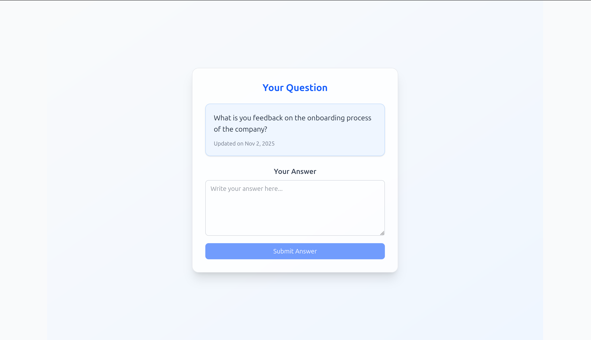
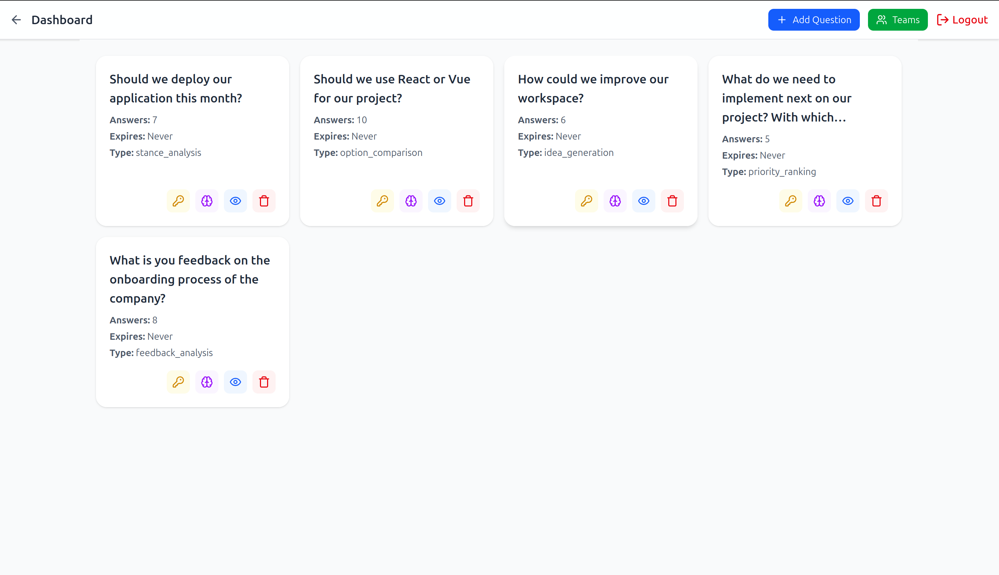
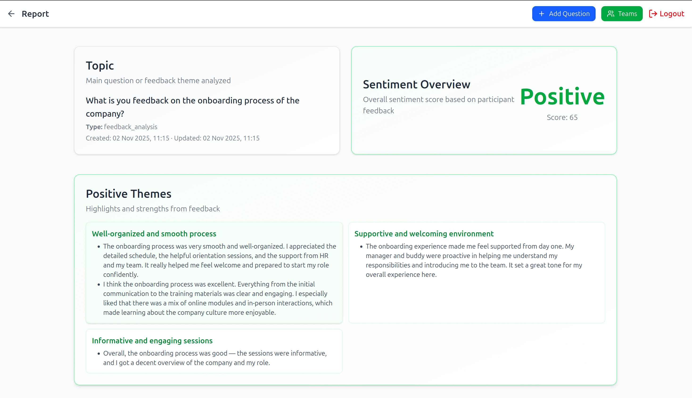

# Project Documentation – inSintesi

## 1. Introduction

At **Endress+Hauser**, decision-making relies on collaboration among thousands of experts worldwide. Aligning these diverse perspectives is key to achieving smarter, faster, and more inclusive outcomes.  

**inSintesi** addresses this challenge by providing an AI-powered platform that collects, analyzes, and synthesizes opinions from teams — enabling organizations to find common ground efficiently and transparently.

The tool transforms diverse viewpoints into meaningful consensus using artificial intelligence, supporting decision-making processes that truly reflect collective intelligence.

---

## 2. Concept & Objectives

The goal of **inSintesi** is to **capture the wisdom of the crowd** through structured input and AI-driven synthesis.  
It allows team leads to create discussions on any topic — from product decisions to sustainability strategies — and collects feedback from participants through a simple and accessible interface.

Key objectives:
- **Gather opinions** from multiple users across teams.
- **Analyze and categorize** input automatically using AI.
- **Visualize consensus** and insights in an intuitive dashboard.
- **Empower decision-makers** with evidence-based, inclusive summaries.

---

## 3. System Architecture

**inSintesi** is built as a web application combining modern web technologies with an AI-powered backend.

**Architecture overview:**
- **Frontend:** Built with **Vite** and **Vue.js** for a responsive, fast, and modular interface.  
  *(Note: The frontend is fully functional locally but has not yet been deployed to production. Deployment is planned as part of the next development phase.)*
- **Backend:** Implemented with **FastAPI** in **Python** for efficient request handling and API management.
- **AI Layer:** Uses the **Mistral AI API** (`mistral-medium-latest`, version 2508, November 2025) for natural language analysis.
- **Database / User Management:** Supports user authentication via email tokens and role-based access for team leads.
- **Visualization:** Dynamic dashboards displaying results tailored to question type and analysis mode.

**Tech stack summary:**
- **Languages:** Python, TypeScript  
- **Frameworks:** FastAPI, Vue.js, Vite  
- **AI API:** Mistral AI (`mistral-medium-latest`)  
- **Hosting:** **Resend** (email handling), **Render** (backend deployment), **Neon** (database)

---

## 4. Implementation

### 4.1 Core Features
- **Team Management:**  
  Team leads can log in and manage their teams via email-based invitations. Each participant receives an individual token, ensuring controlled access.
  
- **Question Types:**  
  The system automatically detects the nature of the question and applies the corresponding AI analysis mode. Supported categories include:
  - `stance_analysis`
  - `option_comparison`
  - `idea_generation`
  - `priority_ranking`
  - `feedback_analysis`

- **AI-Powered Analysis:**  
  Using prompt-engineered templates, the backend sends participant responses to Mistral AI. The model interprets the data and synthesizes themes, patterns, or rankings depending on the question type.

- **Dashboard Visualization:**  
  Results are displayed in an interactive dashboard. Each question type is visualized differently to best represent the insights (e.g., sentiment distribution, ranked priorities, summarized options).  
  *(The visualization layer works locally and is ready for deployment in the next iteration.)*

### 4.2 Data Flow
1. **Question creation** by a team lead.  
2. **Question type classification** by the AI model.  
3. **Participants submit answers** via individual or universal token links.  
4. **AI analysis** processes responses using the appropriate prompt template.  
5. **Results visualization** on the team dashboard, tailored to the analysis mode.

---

## 5. User Journey

1. **Team Lead Login:**  
   The lead logs into the web platform and creates a new discussion question.

2. **Participant Invitation:**  
   The system generates individual or universal tokens, automatically distributed by email.

3. **Opinion Submission:**  
   Participants answer directly from the web interface.

4. **AI Consensus Generation:**  
   Once responses are collected, the system triggers Mistral-based analysis pipelines.

5. **Dashboard Overview:**  
   The team lead can view aggregated insights — showing agreement zones, conflicting views, and summarized perspectives.  
   *(This functionality is fully implemented and tested locally.)*

---

## 6. Results & Evaluation

During the hackathon, the complete backend pipeline — including authentication, question management, AI analysis, and data handling — was successfully implemented and demonstrated.  

The frontend was fully functional locally but **not yet deployed to production** due to time limitations. Despite this, all backend and AI workflows were validated through API tests and local UI interaction.

The system effectively demonstrated:
- Automatic adaptation to question type.
- Accurate and interpretable AI summaries.
- A clear and scalable architecture ready for deployment.

---

## Some images

Landing Page

Answer Question Page

Dashboard

Example Report

## 7. Future Work & Improvements

While the MVP performed well, several enhancements are planned for future iterations:
- **Frontend Deployment:** Deploy the Vue.js frontend to production and integrate it fully with the FastAPI backend.
- **Enhanced prompt engineering:** More sophisticated analysis pipelines and fine-tuned models for improved contextual understanding.  
- **Registration and onboarding:** Dedicated registration flow for new users and teams.  
- **Advanced analytics:** Clustering visualization, exportable reports, and trend tracking over time.  
- **Integration options:** Slack, Teams, or other collaboration tools for easier access and participation.

---
